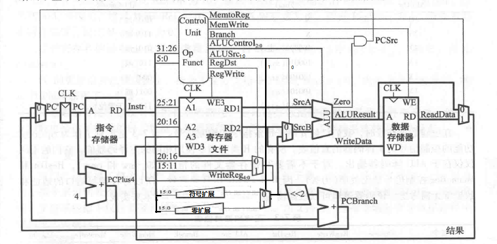

# 单周期MIPS实验报告

郑逸宁 15307130115

### 项目概要

本次实验是MIPS相关实验的第一部分。因为教材《数字设计和计算机体系结构》上有MIPS单周期实现的详细介绍和大部分代码，而大部分同学都是参加教材完成的，所以我实验报告主要突出在自己做的一些工作。

### 项目实现

+ 使用System Verilog实现，源代码以.sv结尾
+ 每个模块单独一个文件更符合结构化设计的理念
+ 对模块进行参数化实现，方便以后扩展成64位
+ 实现了add，sub，and，or，slt，addi，andi，ori，slti，sw，lw，j，nop，**beq，bne** 共15个指令
+ 同时使用$display()和波形图两种方式在仿真中进行调试
+ 在Nexys4实验板上实现了：可暂停演示、七段数码显示十六进制、指令寄存器显示器切换等功能

### 项目结构

```
/images/ 	实验截图
/test/		测试所需替换的.dat文件，simulation.sv文件，以及生成.dat文件的.s文件
/MIPS_V1.0.cache(hw,ip_user_files,runs,sim)		
			Vivado工程所需的各类文件
/MIPS_V1.0.srcs/sources_1/new	
			项目的核心代码
	testbranch.sv	在Nexys4实验板上测试的顶层模块
	clkdiv.sv		时钟分频模块模块，用于演示
	simulation.sv	仿真时使用的顶层模块
	top.sv			包含mips和两块内存的顶层模块
	mips.sv			mips处理的顶层模块
	dmem.sv			数据内存
	imem.sv			指令内存
	controller.sv	mips的控制单元，包含maindec和aludec两部分
	maindec.sv		主控单元，有总共11位的控制信号
	aludec.sv		alu控制单元，用于输出alucontrol信号
	datapath.sv		数据通路，mips的核心结构
	regfile.sv		寄存器文件
	alu.sb			alu计算单元
	adder.sv		加法器
	sl2.sv			左移2位
	flopr.sv		可复位触发器
	mux2.sv			2:1复用器
	signextend.sv	符号拓展模块
	zeroextend.sv	零拓展模块
```

<div STYLE="page-break-after: always;"></div>

### 实验过程

因为我不是16级的学生，我首先需要学习的是Vivado的使用方法和System Verilog的语法。我花了2节课的时间阅读了教材的第四章和Vivado使用文档，并快速地在教材的第五章中找到ALU相关知识点，写好了我第一个System Verilog程序——ALU模块。我同时学会了利用仿真来测试模块的方法，测试出ALU模块在8种不同的输入下都能给出正确的输出。

随后我继续阅读了教材第六章的内容，了解了MIPS指令和他们对应的机器码。阅读了实验要求和<MIPS指令集.pdf>，在小本子上记下了要求的15个指令（我看错了，实际上只要求13个）的机器码结构，为下一步的设计打下了基础。其中我发现MIPS指令中nop指令实际上是sll指令的一个特例，所以我把nop指令和add，or等指令用同样的通路实现了。

随后，我继续学习了教材的第七章。我对单周期CPU工作原理的理解是这样的：在单周期CPU工作时，我们首先要根据现在的PC值从内存空间中找到待操作的指令，然后根据指令的op和func部分来决定指令的计算路径。根据这一特性，我们可以把CPU大体上划分为控制单元和数据通路两个部分。控制单元根据指令的op和func输出若干信号，控制数据通路中的若干个复用器来实现控制数据通路，同时也输出一个控制信号来决定ALU的计算模式。在设计控制单元的时候可以把控制ALU的部分单独计算，以便让相同类型的指令使用同样的路径。

在数据通路的设计上，书上给出了详细的介绍——先设计出寻找下一个PC的基本回路；然后为sw，lw两个指令增添寄存器到内存的回路；接着为R类指令和I类设计出寄存器到寄存器的指令；最后为j，beq，bne等跳转指令设计出计算出下一个PC的其它路径。在每添加一种路径的时候，都要修改控制单元使CPU能选择正确的数据通路进行计算。

在具体的代码实现上，我也积极参考了教材第七章的内容，具体实现的时候只需要为支持addi和ori的增加一个零扩展模块，并将maindec的controls拓展到11位即可。在这样的修改后，我可以轻松地实现这十几个mips指令。拓展之后的mips结构如下图：

<div STYLE="page-break-after: always;"></div>

在实现指令后，我利用PPT中介绍的QtSpim软件生成了若干测试用的汇编代码(.s文件)，以及他们的十六进制文件（.dat文件），测试时以不同的.dat文件作为输入。如果执行这些代码能得到期望的结果，则说明我的代码有较大概率是正确的。当然，粗心的我还是犯了一些拼写错误，第一次仿真没有得到正确的结果；我一开始利用波形图的方式，查看各个寄存器的值，来查看自己的问题所在，波形图大致如下（大部分红色之中的绿色是寄存器的值）：


通过波形图的方法，我可以查看各个寄存器的值，验证自己程序的正确性。但我随后又发现了一种更高效的方法——利用verilog内置的\$display()函数，可以在Tcl Console 里面用打印出自己想要格式的变量值，并利用\$stop命令在验证完成后直接退出，大致效果如下：


我编写了不同的.dat测试文件和其对应的仿真顶层模块，放在test文件夹下。测试时替换更目录下memfile.dat和源文件中的仿真顶层模块即可。

<div STYLE="page-break-after: always;"></div>

最后，我开始进行Synthesis和Implementation的步骤，并生成可执行文件，导入开发板进行测试。其中，工程的资源占用情况如下：


时钟情况如下图：


### 元件接口 

```verilog
/*
大部分的元件名称和变量名称已经表明了它们的意思，这里只注释部分不太清楚的名称
*/
module adder#(parameter N = 32)(
    input   logic [N-1:0]    adder_a, adder_b,
    output  logic [N-1:0]    adder_y
    );
  
module sl2#(parameter N = 32)(
    input   logic [N-1:0] sl2_a,
    output  logic [N-1:0] sl2_y
    );

module alu#(parameter N = 32)
    (input  logic [N-1:0] alu_a,alu_b,
    input   logic [2:0]   alu_control,
    output  logic [N-1:0] alu_y,
    output  logic         zero
    );
    
module flopr #(parameter WIDTH = 32)
    (input  logic               clk,reset,
    input   logic [WIDTH-1:0]   flopr_d,
    output  logic [WIDTH-1:0]   flopr_q
    );

module mux2#(parameter WIDTH = 32)
    (input [WIDTH-1:0]  mux2_d0,mux2_d1,
    input               mux2_s,
    output [WIDTH-1:0]  mux2_y
    );

module signextend#(parameter HALF = 16)(
    input   logic [HALF-1:0]    se_a,
    output  logic [2*HALF-1:0]  se_y
    );
    
module zeroextend#(parameter HALF = 16)(
    input   logic [HALF-1:0]    ze_a,
    output  logic [HALF*2-1:0]  ze_y
    );
    
module regfile#(parameter N = 32, L = 32)(
    input   logic           clk,
    input   logic           we3,			//是否写寄存器
    input   logic [4:0]     ra1, ra2, wa3,	//读写寄存器的下标
    input   logic [N-1:0]   wd3,			//写进寄存器的值
    output  logic [N-1:0]   rd1, rd2		//从寄存器读出的值
    );
    
module datapath#(parameter N = 32, HALF = 16)(
    input   logic       clk, reset,
    input   logic       memtoreg, pcsrc,//是否有内存到寄存器的操作，控制pc计算路径
    input   logic [1:0] alusrc,		   //控制alu第二个参数的计算路径
    input   logic       regdst,		   //控制寄存器目的计算路径
    input   logic       regwrite, jump,//是否写寄存器，是否是跳转命令
    input   logic [2:0] alucontrol,	   //控制alu中进行的运算类型
    output  logic       zero,		  //alu结果是否为零
    output  logic[N-1:0] pc,		  //输出计算好的下一个PC值
    input   logic[N-1:0] instr,		  //读入的32位指令
    output  logic[N-1:0] aluout, writedata,//alu的输出结果（用于内存寻址），写到内存中的数据
    input   logic[N-1:0] readdata	  //从内存中读的数据
    );
    
module controller(
    input   logic [5:0] op, funct,			
    input   logic       zero,				//alu结果是否为零
    output  logic       memtoreg, memwrite,	 //是否有内存到寄存器的操作，是否写内存操作
    output  logic       pcsrc,				//控制pc计算路径
    output  logic [1:0] alusrc,				//控制alu第二个参数的计算路径
    output  logic       regdst, regwrite,	 //控制寄存器目的计算路径，是否有写寄存器操作
    output  logic       jump,				//是否是跳转命令
    output  logic [2:0] alucontrol			//控制alu中进行的运算类型
	);
    
module maindec(
    input   logic [5:0] op,					
    output  logic       memtoreg, memwrite,	 
    output  logic       branch,				//控制分支语句的计算路径
    output  logic [1:0] alusrc,				//控制alu第二个参数的计算路径
    output  logic       regdst, regwrite,	 //控制寄存器目的计算路径，是否有写寄存器操作
    output  logic       jump,				//是否是跳转命令
    output  logic [2:0] aluop				//和funct一起决定alucontrol的值
    );
    
module aludec(
    input   logic [5:0] funct,		
    input   logic [2:0] aluop,		//和funct一起决定alucontrol的值
    output  logic [2:0] alucontrol	//控制alu中进行的运算类型
    );

module mips#(parameter N = 32)(
    input   logic        clk, reset,
    output  logic[N-1:0] pc,
    input   logic[N-1:0] instr,				//读入的指令
    output  logic        memwrite,			//是否有写寄存器操作
    output  logic[N-1:0] aluout, writedata,	//向内存写入数据的地址，写到内存中的数据
    input   logic[N-1:0] readdata			//从内存中读入的数据
);
    
module imem#(parameter N = 32, L = 64)(
    input   logic [5:0] a,	 //读的地址
    output  logic [N-1:0] 	 rd  //读出的数据
    );
    
module dmem#(parameter N = 32, L = 64 ，LL=6)(
    input   logic           clk, we,//clk，是否写入数据
    input   logic [LL-1:0]   a, wd,	//读写的地址，写入的数据
    output  logic [N-1:0]   rd		//读出的数据
    );
    
module top#(parameter N = 32)(	
    input   logic       clk, reset,
    									 //顶层模块的输出用于测试
    output  logic [N-1:0]writedata, dataadr, //写入内存的值和写入的地址
    output  logic        memwrite,			//是否写内存
    output  logic [N-1:0]instr, 			//正在执行的指令
    output  logic [5:0]  pclow				//pc的低位(7~2位)
);
```

### 实验心得

我对于这一次实验感到非常开心。一方面，我在和其他同学相比，没有System Verilog基础、没有完成Y86项目（这门课的另一个实验）的情况下，用更少的时间完成了更多的任务；另一方，我从自己能够通过查阅Nexys4手册、MIPS指令集手册自学到很多东西中发现了自己的进步。但同时，我也有很多不足，一些拼写错误浪费了我很多时间调bug，而在设计控制单元的时候也没有一开始就规划好control的位数。